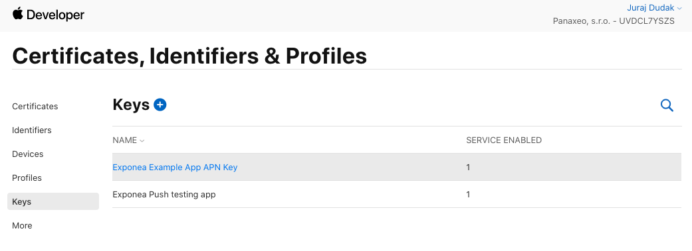
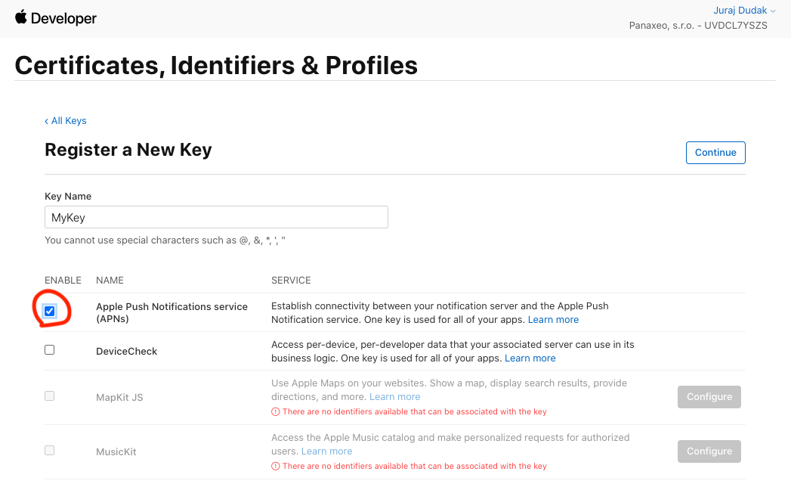
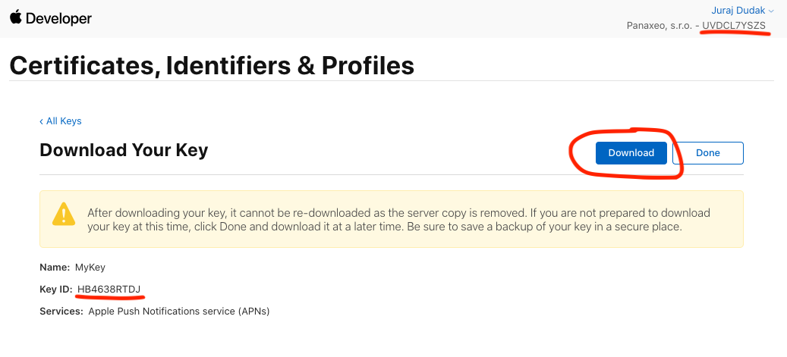
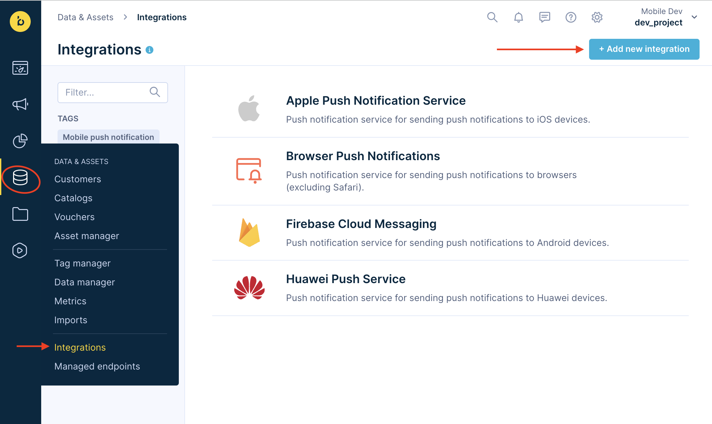
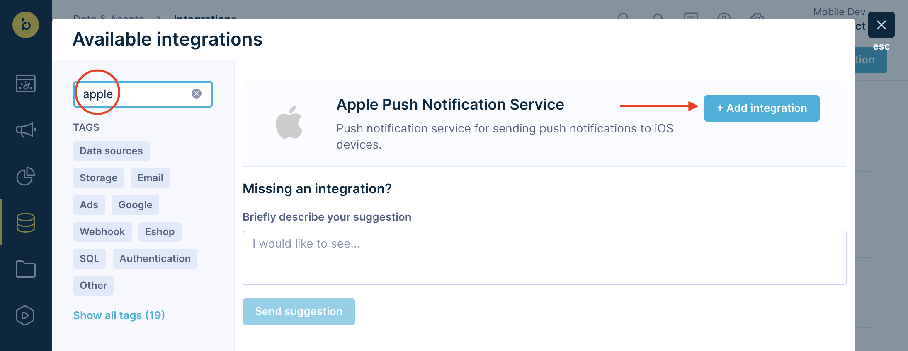
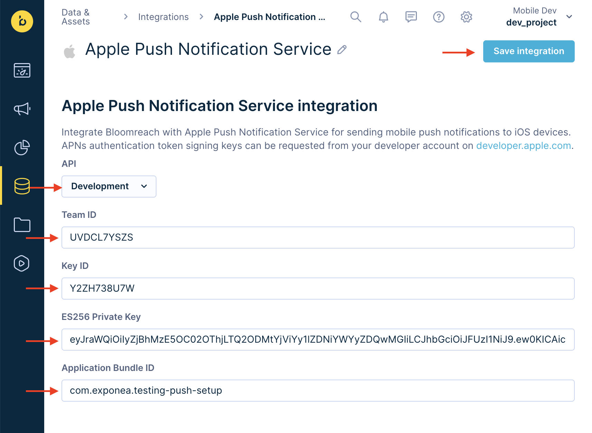
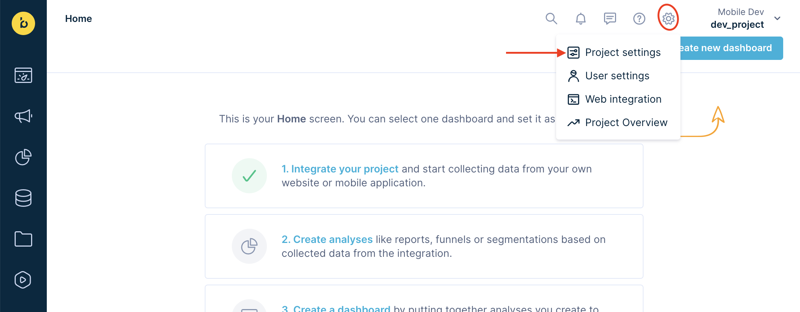
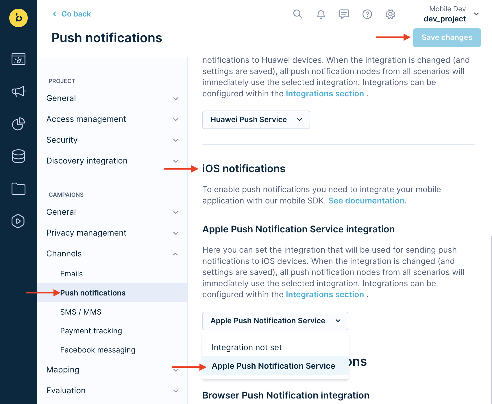

# Bloomreach web app push notification configuration
To be able to send push notifications from Bloomreach, you will need to create an Apple Push Notification service key and add it to the Bloomreach web app.

## Creating APNs key
1. Open your [Apple developer console](https://developer.apple.com/account/resources/authkeys/list), navigate to `Certificates, Identifiers & Profiles` and open `Keys` .

2. Add a new key and select APNs

3. Confirm the creation of the key. To configure Bloomreach you'll need the downloaded `p8 file`, `Team id` located in the top right corner and `Key Id`. Mark these down and you are done with configuration on Apple side.

## Adding APNs key to Bloomreach

1. Open you Bloomreach web application and navigate to `Integrations` and `+ Add new integration`
   

2. Search for `Apple Push Notification Service` and add this integration.
   

3. Scroll down to Apple push notifications and fill in the details. `ES256 Private Key` is the p8 file you downloaded from Apple developer portal. Open it as text file and copy-paste the contents.
   

4. Navigate to `Project Settings`.
   

4. Go to `Push notifications`, find `iOS notifications` part and select your integration. Then click `Save changes`
   

## Great job!
Bloomreach web application is now set up to send push notifications to your application. Once you finish [push notification setup](./IOS_PUSH.md), try [sending push notifications](./PUSH_SEND.md).