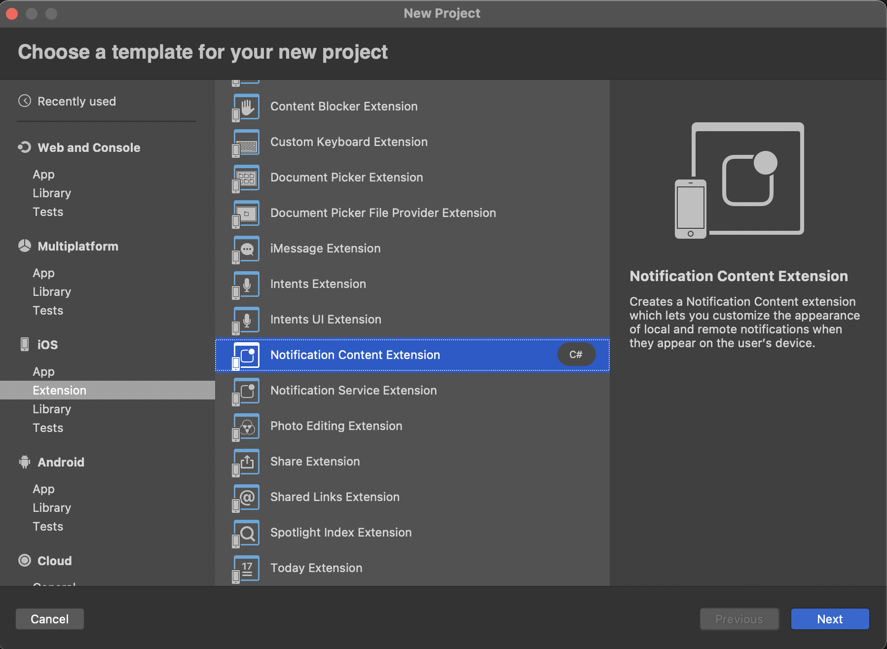
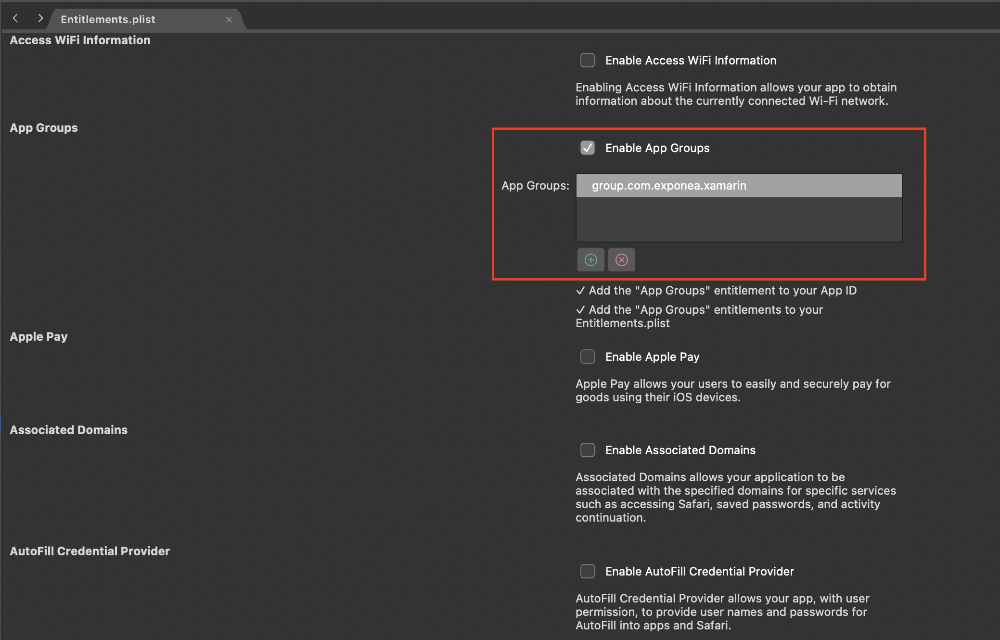
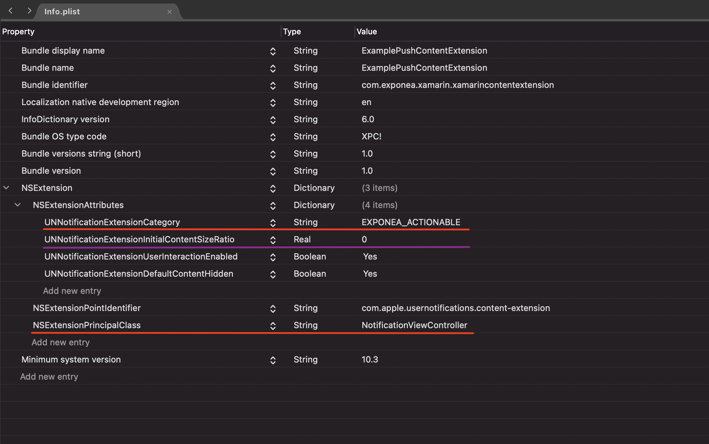

## 📣  Push Notifications

Bloomreach allows you to easily create complex scenarios which you can use to send push notifications directly to your customers. The following section explains how to enable push notifications for iOS.

  
## Quickstart

For push notifications to work, you'll need to set up a few things:

- create an Apple Push Notification service(APNs) key

- integrate push notifications into your application

- set the APNs key in the Bloomreach web app

  

We've created a [Quick start guide](#quick-start-guide) to guide you through these steps.

## Handling push notification opening

Bloomreach SDK contains methods to handle Push notification data and invoke actions.

```csharp
using Bloomreach;
using Foundation;
using UIKit;
using UserNotifications;

[Register("AppDelegate")]
public partial class AppDelegate : MauiUIApplicationDelegate, IUNUserNotificationCenterDelegate {
    
    public override bool FinishedLaunching(UIApplication application, NSDictionary launchOptions)
    {
        UNUserNotificationCenter.Current.Delegate = this;
        return base.FinishedLaunching(application, launchOptions);
    }
    
    [Export("application:didReceiveRemoteNotification:fetchCompletionHandler:")]
    public void DidReceiveRemoteNotification(UIApplication application, NSDictionary userInfo, Action<UIBackgroundFetchResult> completionHandler)
    {
        // Notification is automatically 'opened' if not shown:
        // - is silent push
        // - foreground app is not showing notification (default 'willPresentNotification' behaviour)
        BloomreachSDK.HandlePushNotificationOpened(NotificationAction.Parse(userInfo));
        completionHandler(UIBackgroundFetchResult.NewData);
    }
    
    [Export("userNotificationCenter:didReceiveNotificationResponse:withCompletionHandler:")]
    public void DidReceiveNotificationResponse(UNUserNotificationCenter center, UNNotificationResponse response, Action completionHandler)
    {
        // Notification is opened by user interaction
        BloomreachSDK.HandlePushNotificationOpened(NotificationAction.Parse(response));
        completionHandler();
    }
}
```

If your app is in the foreground when a notification arrives, the shared user notification center calls method with `willPresentNotification` that asks the delegate how to handle a notification that arrived while the app was running in the foreground.
See [Apple documentation](https://developer.apple.com/documentation/usernotifications/unusernotificationcenterdelegate/1649518-usernotificationcenter?language=objc) for more info.
If you want to show a notification in foreground mode, override the behaviour as:
```csharp
[Export("userNotificationCenter:willPresentNotification:withCompletionHandler:")]
public void WillPresentNotification(UNUserNotificationCenter notificationCenter, UNNotification notification,Action<UNNotificationPresentationOptions> completionHandler)
{
    completionHandler(
        UNNotificationPresentationOptions.Sound
        | UNNotificationPresentationOptions.Alert
        | UNNotificationPresentationOptions.Badge
    );
}
``` 

## Tracking delivered notifications

Notification service extension is required for tracking push notification delivery. This extension is part of the Rich notifications setup described in [Quick start guide](#quick-start-guide).

> The behaviour of Push delivery and click tracking may be affected by the tracking consent feature, which in enabled mode considers the requirement of explicit consent for tracking. Read more in [tracking consent documentation](../Documentation/TRACKING_CONSENT.md).

## Silent push notifications

Bloomreach SDK supports both regular "alert" push notifications and silent push notifications (Background Updates). To receive a notification, you need to track your push token to the Bloomreach backend. When push notification tracking is enabled and properly implemented, this will happen automatically. By default, the token is only tracked when the app is authorized to receive *_alert_* push notifications. You can change this by setting the configuration variable `RequirePushAuthorization = false`. With this setting, the SDK will register for push notifications and track the push token at the application start. Push notification authorization status is tracked as customer property `apple_push_notification_authorized`.

``` csharp
var config = new Configuration("project-token", "your-auth-token", "https://api.exponea.com")
{
    AppGroup = "group.your.app.group",
    RequirePushAuthorization = false
};
Bloomreach.BloomreachSDK.Configure(config);
```

> Silent push notifications require `Background Modes` `Remote notifications` capability.


## Multiple push notification sources

The SDK only handles push notifications coming from the Bloomreach backend. If you use other servers than Bloomreach to send push notifications, you'll need to implement some of the logic yourself.

### Conditional processing

[Quick start guide](#quick-start-guide) describes delegates/extensions required for Bloomreach push notification handling to work. You can use the method `Bloomreach.BloomreachSDK.IsBloomreachNotification(NotificationPayload.Parse(userInfo))` in the delegate/extension implementations to check if the notification being processed is coming from Bloomreach servers and either call Bloomreach method or process the notification using implementation for other push notification source.

### Manual tracking

You can completely disable notification tracking and use methods `Bloomreach.BloomreachSDK.TrackPushToken`, `Bloomreach.BloomreachSDK.TrackDeliveredPush` and `Bloomreach.BloomreachSDK.TrackClickedPush` to track push notification events.  You can always track `campaign` event manually with TrackEvent(Event event) and any payload you need.

> The behaviour of Push delivery and click tracking may be affected by the tracking consent feature, which in enabled mode considers the requirement of explicit consent for tracking. Read more in [tracking consent documentation](../Documentation/TRACKING_CONSENT.md).

# Quick start guide

> To send push notifications, we need to track Firebase token to Bloomreach servers. So please make sure [tracking](./TRACK.md) is working before configuring push notifications.

## Setup process

1. [Setting application capabilities](#1-application-capabilities)

2. [Updating Bloomreach configuration](#2-configuration)

3. [Implementing application delegate methods](#3-application-delegate-methods)

4. [Configuring Bloomreach to send push notifications](#4-configuring-Bloomreach-to-send-push-notifications)

5. [Authorizing the application for receiving push notifications](#5-authorizing-for-receiving-push-notifications)

6. [Rich push notifications](#6-rich-push-notifications)(optional)


## 1. Application capabilities

You need to set up capabilities for your application. To do so, select your application in XCode, go to `Signing & Capabilities`, and add capabilities:

- `Push Notifications` is required for alert push notifications.

- `Background Modes` and select `Remote notifications` required for silent push notifications.

- `App Groups` and create a new app group for your app. This is required for application extensions that will handle push notification delivery and rich content.

  

> To add `Push Notifications` capability, your Apple developer account needs to have paid membership. Without it, the capability selector doesn't contain this capability at all.


## 2. Configuration

To enable push notifications, configure the SDK with the app group created in the previous step.

``` csharp

var config = new Configuration("project-token", "your-auth-token", "https://api.exponea.com")
{
    AppGroup = "group.your.app.group"
};
Bloomreach.BloomreachSDK.Configure(config);
```

## 3. Application delegate methods

The application needs so to be able to respond to push notification-related events.

You will need to set up three delegate methods:

- `RegisteredForRemoteNotifications` will be called when your application registers for push notifications.

- `DidReceiveRemoteNotification` will be called for silent push notifications and alert push notifications when your app is opened.

- `DidReceiveNotificationResponse` will be called when a user opens an alert push notification.

``` csharp
using Bloomreach;
using Foundation;
using UIKit;
using UserNotifications;

[Register("AppDelegate")]
public partial class AppDelegate : MauiUIApplicationDelegate, IUNUserNotificationCenterDelegate {
    
    public override bool FinishedLaunching(UIApplication application, NSDictionary launchOptions)
    {
        UNUserNotificationCenter.Current.Delegate = this;
        return base.FinishedLaunching(application, launchOptions);
    }
    
    [Export("application:didReceiveRemoteNotification:fetchCompletionHandler:")]
    public void DidReceiveRemoteNotification(UIApplication application, NSDictionary userInfo, Action<UIBackgroundFetchResult> completionHandler)
    {
        // Notification is automatically 'opened' if not shown:
        // - is silent push
        // - foreground app is not showing notification (default 'willPresentNotification' behaviour)
        BloomreachSDK.HandlePushNotificationOpened(NotificationAction.Parse(userInfo));
        completionHandler(UIBackgroundFetchResult.NewData);
    }
    
    [Export("userNotificationCenter:didReceiveNotificationResponse:withCompletionHandler:")]
    public void DidReceiveNotificationResponse(UNUserNotificationCenter center, UNNotificationResponse response, Action completionHandler)
    {
        // Notification is opened by user interaction
        BloomreachSDK.HandlePushNotificationOpened(NotificationAction.Parse(response));
        completionHandler();
    }
    
    [Export("application:didRegisterForRemoteNotificationsWithDeviceToken:")]
    public void RegisteredForRemoteNotifications(UIApplication application, NSData deviceToken)
    {
        BloomreachSDK.HandlePushToken(deviceToken);
    }
}
```

#### Checklist:

- your `RegisteredForRemoteNotifications` delegate method calls `HandlePushToken`

- your `DidReceiveRemoteNotification` and `DidReceiveNotificationResponse` calls `HandlePushNotificationOpened`

- you call `UNUserNotificationCenter.Current.Delegate = this;`

## 4. Configuring Bloomreach to send push notifications

To send push notifications from the Bloomreach backend, you need to connect the Bloomreach web application to the Apple Push Notification service. To do so, open Project settings in your Bloomreach app and navigate to Channels/Push notifications. Fill in all the field: `Team ID`, `Key ID`, `ES256 Private Key`, and `Application Bundle ID`.

[Bloomreach web app push notification configuration](./APNS.md) guide contains screenshots showing where the data is located.

## 5. Authorizing for receiving push notifications

You can receive silent push notifications without any permissions, but you'll need special permission for messages visible to the user.

``` csharp
public void RegisterForRemoteNotifications()
        {
            if (UIDevice.CurrentDevice.CheckSystemVersion(8, 0))
            {
                var pushSettings = UIUserNotificationSettings.GetSettingsForTypes(
                                   UIUserNotificationType.Alert | UIUserNotificationType.Badge | UIUserNotificationType.Sound,
                                   new NSSet());

                UIApplication.SharedApplication.RegisterUserNotificationSettings(pushSettings);
                UIApplication.SharedApplication.RegisterForRemoteNotifications();
            }
            else
            {
                UIRemoteNotificationType notificationTypes = UIRemoteNotificationType.Alert | UIRemoteNotificationType.Badge | UIRemoteNotificationType.Sound;
                UIApplication.SharedApplication.RegisterForRemoteNotificationTypes(notificationTypes);
            }
        }
```

#### Checklist:

- Bloomreach should now be able to send push notifications to your device. To learn how you can check the [Sending Push notifications](./PUSH_SEND.md) guide. A push notification will not display rich content just yet. We'll set it up in the next step.


## 6. Rich push notifications

iOS application needs two application extensions to be able to show custom image and buttons in push notifications. To create an extension, select `Add/New Project/iOS Extension`

>  Make sure that the `iOS Deployment Target` of your extensions is the same as the target for your main app. Visual Studio will set it to the latest when creating extensions.



### Notification Service Extension

Create a new Notification Service Extension and give it `App Groups` capability selecting the group you created for your main app.



In the extension, you have to call Bloomreach methods for processing notifications and handling timeouts. For iOS extensions, separate App-Extension safe dependency was created. Use BloomreachSDK.iOS.Notifications package as dependecy in extensions.

``` csharp
using ObjCRuntime;
using UserNotifications;
using Bloomreach;

namespace ExamplePushServiceExtension
{
    [Register("NotificationService")]
    public class NotificationService : UNNotificationServiceExtension
    {

        #region Constructors
        protected NotificationService(IntPtr handle) : base(handle)
        {
            // Note: this .ctor should not contain any initialization logic.
        }
        #endregion

        #region Override Methods
        public override void DidReceiveNotificationRequest(UNNotificationRequest request, Action<UNNotificationContent> contentHandler)
        {
            if (!Bloomreach.BloomreachSDK.HandleRemoteMessage("group.your.app.group", request, contentHandler))
        {
            Console.WriteLine("Remote Message received without Bloomreach content");
        }
        }

        public override void TimeWillExpire()
        {
            Bloomreach.BloomreachSDK.HandleRemoteMessageTimeWillExpire();
        }
        #endregion
    }
}

```

### Notification Content Extension

Create a new Notification Content Extension. By default, the extension will contain a storyboard file that you can delete; we'll change the default view controller implementation. The service extension that we created in the previous step will change the notification `categoryIdentifier` to `EXPONEA_ACTIONABLE`. We have to configure the content extension to display push notifications with that category. Open `Info.plist` in created content extension group and add `UNNotificationExtensionCategory`. Next, remove `NSExtensionMainStoryboard` and instead use `NSExtensionPrincipalClass` set to your view controller.

Notice the parameter `UNNotificationExtensionInitialContentSizeRatio` (with the default value 1). It specifies the ratio between the width and the height of the content in the push notification. By default, the content is as high as it's wide. This setting is not part of the SDK, but it can cause showing white space when notification is without the content (image). Change this value to 0 if you want the height to be dynamic (it will grow to the needed height if there is an image present, but there will be no blanc space if there is not).
  
We also recommend to set `UNNotificationExtensionUserInteractionEnabled` and `UNNotificationExtensionDefaultContentHidden` attributes to true.



Your view controller class should just forward the notification to our service that will correctly display it.

``` csharp
using System;
using Foundation;
using UIKit;
using UserNotifications;
using UserNotificationsUI;
using BloomreachSdkNotifications;


namespace ExamplePushContentExtension
{

    [Register("NotificationViewController")]
    public partial class NotificationViewController : UIViewController, IUNNotificationContentExtension
    {

        protected internal NotificationViewController(NativeHandle handle) : base(handle)
        {
            // Note: this .ctor should not contain any initialization logic.
        }

        public override void ViewDidLoad()
        {
            base.ViewDidLoad();
            // Do any required interface initialization here.
        }

        public void DidReceiveNotification(UNNotification notification)
        {
            Bloomreach.BloomreachSDK.HandleNotificationReceived(notification, ExtensionContext, this);
        }
    }
}

```

#### Checklist:

- push notification with image and buttons sent from the Bloomreach web app should be properly displayed on your device. Push delivery tracking should work.

- if you don't see buttons in the expanded push notification, it means the content extension is ****not**** running. Double-check `UNNotificationExtensionCategory` in the Info.plist - notice the placement inside `NSExtensionAttributes`. Check that the `iOS Deployment Target` is the same for extensions and the main app.

## Great job!

You should now be able to use Bloomreach push notifications.

To further configure push notifications, check the complete documentation for [Configuration](./CONFIG.md).
